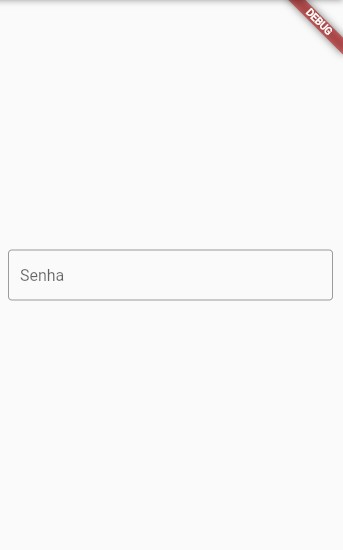
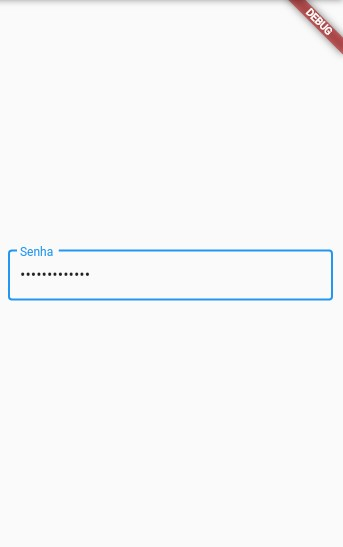

# TextField

Sabe quando vemos em aplicativos alguns campos de texto em que podemos colocar nomes, e-mails, senhas e demais informações? Até mesmo quando queremos escrever algo que tenha uma quantidade maior de linhas?
Pois bem, esses são os famosos `inputs` (digamos que esse seria um nome "global"). No Flutter, chamamos esses inputs de `TextField`!

Nele podemos definir diversos valores como valor/texto inicial, labels, hints, número de linhas, número de caracteres e também podemos decorá-lo com a classe `InputDecoration` para deixar a cara do seu app. Além de podermos associá-lo a um controller (`TextEditingController`) que nos permite manipular e atualizar o texto inserido no TextField.

<br/>
<div align='center'>
    <i>
        <b>
            Lembre-se de prestar atenção nos comentários dos códigos ^-^
        </b>
    </i>
</div>

<br/>
<br/>

Demonstração da implementação do TextField

```dart
TextField(
  decoration: InputDecoration(
    border: OutlineInputBorder(),
    labelText: 'E-mail',
  ),
)
```

```dart
final _controller = TextEditingController(); // O TextEditingController é um controller utilizado para manipular o texto do TextField
```

```dart
Center(
    child: Container(
        padding: EdgeInsets.all(10),
        /*
        Aqui nós estamos chamando o Widget TextField
        */
        child: TextField(
            obscureText: true, // a propriedade obscureText serve para mascarar o texto, deixando-o com cara de input de senha quando digita
            controller: _controller,
            decoration: InputDecoration(
            border: OutlineInputBorder(),
            labelText: 'Senha',
            ),
        ),
    ),
    ),
```

O TextEditingController possui um `.text` e `.value` que podemos utilizar para determinados casos em que estamos atualizando o conteúdo do TexField. Quando associado a um TextField ou [TextFormField](https://api.flutter.dev/flutter/material/TextFormField-class.html), o TextEditingController atualiza automaticamente o valor do texto internamente, podendo ser resgatado através do getter `.text`.




<br/>
<br/>

Quando usamos o `controller` no TextField com o TextEditingController, não podemos utilizar o campo `onChanged`. Isso pelo motivo deste campo também ser utilzado para manipulação (e atualização) do texto no formulário.

```dart
.
.
.
onChanged: (texto) {
                /*
                A propriedade onChanged recebe uma String (texto), e essa String é sempre atualizada quando há alguma alteração no TextField

                Aqui estamos dizendo que o conteúdo do TextField será atualizado com o texto que está sendo digitado.
                */
            setState(() {
                textoFormulario = texto;
            });
            },
```
O estado do `onChanged` SEMPRE é atualizado quando o usuário digita ou deleta algum caracter do campo de texto. Ou seja, a cada caracter digitado, podemos *"escutar"* essas alterações.

O `TextEditingController`, por sua vez, já sabemos que realiza a alteração do estado do texto de uma forma programática e interna. E, caso queiramos *"escutar/notificar essas alterações"*, podemos chamar *"adicionar uma escuta"* com o método `TextEditingController.addListener`.

```dart
    _controller.addListener(() {
        print(_controller.text);
    });
    ///
    /// Assim, cada vez que digitarmos, veremos essa atualização caracter a caracter.
    ///
```

`DICA!! :)` <br/>
Às vezes quando queremos colocar um valor inicial nos inputs (geralmente quando buscamos dados de alguma API ou então quando já vem por padrão do app), é uma ótima ideia usarmos um atributo do TextField chamado de `initialValue` para isso!


