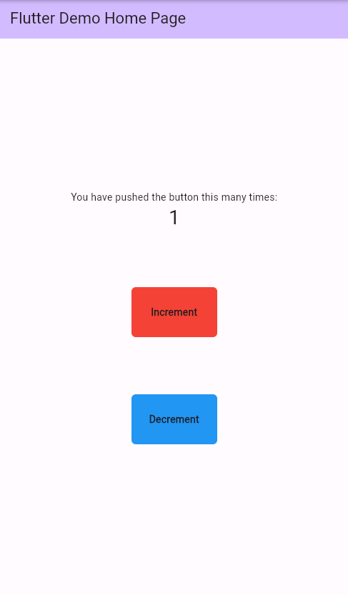
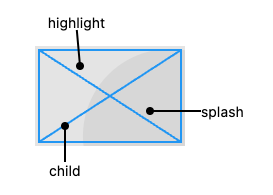

# Gesture Detector & InkWell

Existirão momentos ao longo do processo de criação de nossos aplicativos em que precisaremos criar componentes que precisam de alguma interação seja para abrir uma nova tela, dialogs, modais, executar alguma ação, etc. Esses componentes, claro, não necessariamente serão botões, ou melhor: não necessariamente serão os Widgets de botão fornecidos pelo próprio Flutter (`ElevatedButton`, `TextButton`, `OutlinedButton`, `IconButton`) nem também Widgets que por padrão já possuem implementação de Gestures/Interações como o `ListTile`.

Às vezes precisaremos de um componente completamente novo, com detalhes que não são possíveis de acrescentar com os Widgets citados acima, precisando então partirmos para a criação desse componente do zero. Seja começando por um `Container` ou uma `Column`, por exemplo, posteriormente "Wrapando" (colocando-os como Widgets filhos) um Widget que atribui a capacidade de interagirmos com vários tipos de cliques nestes Widgets.

Neste caso, temos dois Widgets com uso BASTANTE recorrente no Flutter: o `GestureDetector` e o `InkWell`, sendo que há algumas diferenças entre eles que serão mostradas aqui.

## Gesture Detector

Ele é o mais simples no quesito 'Gestures' no Flutter, pois basicamente permite a interação por meio de cliques únicos, cliques duplos, 'press' (`onLongPress`), 'drags' (arrastes)...

Vamos ao código de exemplo:

> Favor, conferir comentários adicionados ao próprio código

```dart
import 'package:flutter/material.dart';

class MyHomePage extends StatefulWidget {

  const MyHomePage({
    Key? key,
  }) : super(key: key);

  @override
  State<MyHomePage> createState() => _MyHomePageState();
}

class _MyHomePageState extends State<MyHomePage> {
  int _counter = 0;

  @override
  Widget build(BuildContext context) {
    return Scaffold(
      appBar: AppBar(
        backgroundColor: Theme.of(context).colorScheme.inversePrimary,
        title: Text(widget.title),
      ),
      body: Center(
        child: Column(
          mainAxisAlignment: MainAxisAlignment.center,
          children: [
            const Text(
              'You have pushed the button this many times:',
            ),
            Text(
              '$_counter',
              style: Theme.of(context).textTheme.headlineMedium,
            ),
            const SizedBox(height: 80),
            /// Implementação do GestureDetector
            GestureDetector(
              onTap: () { // Permite adicionarmos uma interação de clique
                setState(() {
                  _counter++;
                },);
              },
              child: Container(
                alignment: Alignment.center,
                height: 70,
                width: 120,
                decoration: BoxDecoration(
                  color: Colors.red,
                  borderRadius: BorderRadius.circular(6),
                ),
                child: const Text('Increment', style: TextStyle(fontWeight: FontWeight.w600,),),
              ),
            ),
            const SizedBox(height: 80),
            GestureDetector(
              onLongPress: () {
                // Neste caso, a ação só será executada ao pressionarmos o botão por um certo tempo (nada muito duradouro)
                setState(() {
                  _counter--;
                },);
              },
              child: Container(
                alignment: Alignment.center,
                height: 70,
                width: 120,
                decoration: BoxDecoration(
                  color: Colors.blue,
                  borderRadius: BorderRadius.circular(6),
                ),
                child: const Text('Decrement', style: TextStyle(fontWeight: FontWeight.w600,),),
              ),
            ),
          ],
        ),
      ),
    );
  }
}
```



Para executarmos alguma ação no botão vermelho, basta clicarmos uma vez nele. No caso, o contador será incrementado. Já no botão azul, basta pressionarmos por um tempinho que sua ação será executada. No caso, o contador será decrementado.

## InkWell

O comportamento em relação a ações é identico ao `Gesture Detector`, porém, diferentemente, ele é um componente que representa uma **área retangular** envolvida pelo Widget `Material`.

O `InkWell` em seus valores padrões pode ser interpretado desta forma:



Ele é um componente que adiciona `highlight` e `splash` à interação com o componente.<br>
No caso do efeito de `splash`, o mesmo só é visível caso o componente filho do `InkWell` seja transparente. Ou seja, caso adicionemos alguma cor, este efeito não será visível. MAS é algo que podemos contornar com algumas estratégias.

Vamos ao código de exemplo:

> Favor, conferir comentários adicionados ao próprio código

```dart
import 'package:flutter/material.dart';

class MyHomePage extends StatefulWidget {

  const MyHomePage({
    Key? key,
  }) : super(key: key);

  @override
  State<MyHomePage> createState() => _MyHomePageState();
}

class _MyHomePageState extends State<MyHomePage> {
  int _counter = 0;

  @override
  Widget build(BuildContext context) {
    return Scaffold(
      appBar: AppBar(
        backgroundColor: Theme.of(context).colorScheme.inversePrimary,
        title: Text(widget.title),
      ),
      body: Center(
        child: Column(
          mainAxisAlignment: MainAxisAlignment.center,
          children: [
            const Text(
              'You have pushed the button this many times:',
            ),
            Text(
              '$_counter',
              style: Theme.of(context).textTheme.headlineMedium,
            ),
            const SizedBox(height: 80),
            /// Implementação do InkWell
            InkWell(
              onTap: () {
                setState(() {
                  _counter++;
                },);
              },
              child: Container(
                alignment: Alignment.center,
                height: 70,
                width: 120,
                decoration: BoxDecoration(
                  borderRadius: BorderRadius.circular(6),
                ),
                child: const Text('Increment', style: TextStyle(fontWeight: FontWeight.w600,),),
              ),
            ),
            const SizedBox(height: 80),
            InkWell(
              onLongPress: () {
                setState(() {
                  _counter--;
                },);
              },
              child: Container(
                alignment: Alignment.center,
                height: 70,
                width: 120,
                decoration: BoxDecoration(
                  borderRadius: BorderRadius.circular(6),
                ),
                child: const Text('Decrement', style: TextStyle(fontWeight: FontWeight.w600,),),
              ),
            ),
          ],
        ),
      ),
    );
  }
}
```

Podemos implementar o InkWell de forma que ele seja filho de um `Material` com a propriedade _color_ adicionada. Assim, veremos o splash funcionando mesmo quando temos cores em nosso componente.

```dart
SizedBox(
      height: 50,
      width: 50,
      child: Material(
        color: Colors.blue,
        child: InkWell(
          onTap: () {
            setState(() {
              _counter++;
            });
          },
        ),
      ),
    ),
```
