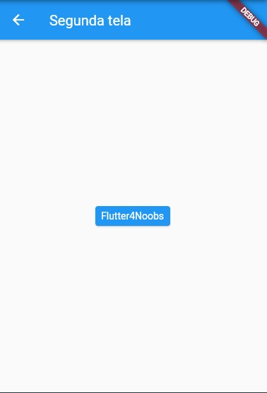

# Formas de Navegar entre Telas no Flutter

Existem algumas formas de navegar entre as telas de um aplicativo.

<div align='center'>
    <u>
    <i>
    Gostaria de abrir um parêntese aqui para que primeiro levemos em consideração uma diferença quanto ao MaterialApp e o CupertinoApp, pois os dois podem apresentar animações de transição diferentes. <br/>
    Irei tratar disso mais adiante nesse artigo.
    </i>
    </u>
</div>
<br/>
<b>
    Obs: Fique de olho nos comentários dos códigos ^-^
<b/>

---

## Navegando para uma tela e voltando

```dart
class PrimeiraRota extends StatelessWidget {
  @override
  Widget build(BuildContext context) {
    return Scaffold(
      appBar: AppBar(
        title: Text('First Route'),
      ),
      body: Center(
        child: ElevatedButton(
          child: Text('Open route'),
          onPressed: () {
              // O método push permite nos levar para uma outra página.
            Navigator.push(
              context,
              MaterialPageRoute(builder: (context) => SegundaRota()),
            );
            /* Estrutura do Navigator.push():
            1 - Recebe o context (BuildContext) da nossa tela
            2 - Utiliza-se a classe MaterialPageRoute para passar o context no construtor (builder), `retornando` para nós a tela que queremos ir.
            3 - Em builder: (context) => TelaQueQueremos(). Você deve utilizar o nome da classe da tela que deseja ir, não importando se extende um Stateless ou StatefulWidget.
            4 - Lembre-se: No flutter, as telas também são Widgets.
            5 - Vale lembrar que o método push coloca a página que queremos ir por cima da atual, mas não fecha/substitui a atual.
            */
          },
        ),
      ),
    );
  }
}

class SegundaRota extends StatelessWidget {
  @override
  Widget build(BuildContext context) {
    return Scaffold(
      appBar: AppBar(
        title: Text("Second Route"),
      ),
      body: Center(
        child: ElevatedButton(
          onPressed: () {
            Navigator.pop(context);
            /*
            Lembra que eu falei que o método .push() coloca a tela que queremos ir sobre a atual? Então. Quando utilizamos o método .pop() nós podemos perceber isso!
            Mas como?
            Como pode ver, no método pop só passamos o context, não precisamos informar a página que queremos voltar. Isso justamente porque a tela SegundaRota() está por cima da tela PrimeiraRota(). Portanto, ao utilizarmos o pop(), retiramos a tela SegundaRota() de cima da PrimeiraRota().
            Imagine esse processo como se tivessemos empilhado as páginas.
            */
          },
          child: Text('Go back!'),
        ),
      ),
    );
  }
}
```

<div align='left'>
     
<div/>

---

## Navegando entre rotas nomeadas

```dart
void main() {
  runApp(MaterialApp(
    title: 'Rotas Nomeadas',
    initialRoute: '/',
    // Por padrão a rota principal do nosso app vem como '/'
    routes: {
      '/': (context) => PrimeiraTela(),
      '/segunda': (context) => SegundaTela(),
    },
  ));
}
// routes recebe um Map<String, dynamic> onde as chaves são as rotas (sempre com '/' antes do nome) e os valores são as telas pertencentes àquela rota.
/*
Seguindo então esse formato:
'/nome_rota': (context) => TelaDesejada(),

Com isso, o Flutter já entendente que aquela rota direciona para aquela página.
*/


class PrimeiraTela extends StatelessWidget {
  @override
  Widget build(BuildContext context) {
    return Scaffold(
      appBar: AppBar(
        title: Text('Primeira tela'),
      ),
      body: Center(
        child: ElevatedButton(
          child: Text('Ir para próxima tela'),
          onPressed: () {
            Navigator.pushNamed(context, '/segunda');
            // A função .pushNamed() permite passarmos o context e uma String da rota. As rotas são sempre determinadas com uma barra '/'. Tendo o formato /nomeDaRota.
          },
        ),
      ),
    );
  }
}

class SegundaTela extends StatelessWidget {
  @override
  Widget build(BuildContext context) {
    return Scaffold(
      appBar: AppBar(
        title: Text("Segunda tela"),
      ),
      body: Center(
        child: ElevatedButton(
          onPressed: () {
            Navigator.pop(context);
            // Como já vimos, quando trocamos de tela e queremos voltar para a anterior (lembrando que, por enquanto, estamos trabalhando numa situação de empilhamento de telas). O .pop() vai desempilhar a tela para a qual navegamos também por meio da rota nomeada.
          },
          child: Text('Voltar!'),
        ),
      ),
    );
  }
}
```

<div align='left'>
     
<div/>

---

## Passando parâmetros entre rotas nomeadas

<b> Vamos utilizar as mesmas telas <b/>

```dart
void main() {
  runApp(MaterialApp(
    title: 'Rotas Nomeadas',
    initialRoute: '/',
    routes: {
      '/': (context) => PrimeiraTela(),
      '/segunda': (context) => SegundaTela(),
    },
  ));
}

class PrimeiraTela extends StatelessWidget {


  final String flutter = "Flutter4Noobs";


  @override
  Widget build(BuildContext context) {
    return Scaffold(
      appBar: AppBar(
        title: Text('Primeira tela'),
      ),
      body: Center(
        child: ElevatedButton(
          child: Text('Ir para próxima tela'),
          onPressed: () {
            Navigator.pushNamed(
              context,
              '/segunda',
              arguments: {'nome': flutter},
            );
            /*
            Note: A função .pushNamed possui um atríbuto de argumentos (arguments), onde podemos passar quaisquer objetos: Map, listas, Strings, valores, classes...
            Neste caso, estou passando um simples Map<> com a chave 'nome' e o valor contendo a variável declarada um pouco acima (flutter).

            Vamos aprender a resgatar esse valor em outra tela?
            */
          },
        ),
      ),
    );
  }
}

// Vamos lá! Agora vamos pegar o valor daquela variável contida naquele Map<> e exibir na segunda tela.

class SegundaTela extends StatelessWidget {

  final argumentos = ModalRoute.of(context)?.settings.arguments as Map<String, dynamic>;
  // A classe ModalRoute permite utilizaros o método .of(), passando um context e pegando os valores de .settings.arguments.
  // Agora, utilizando a variável 'argumentos' conseguiremos pegar o valor que foi passado para a rota dessa tela.
  // Perceba que foi utilizado um "as Map<String, dynamic>" para deixar claro que o tipo de argumento esperado é um Map<>.

  @override
  Widget build(BuildContext context) {
    return Scaffold(
      appBar: AppBar(
        title: Text("Segunda tela"),
      ),
      body: Center(
        child: ElevatedButton(
          onPressed: () {
            Navigator.pop(context);
          },
          child: Text('${argumentos['nome']}'),
          // Como passamos um Map<> em 'arguments', basta chamarmos pela chave onde está o valor que armazenamos na primeira tela.
        ),
      ),
    );
  }
}
```

<div align='left'>
     
<div/>
