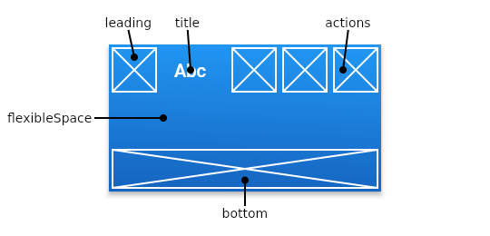

## AppBar

Você provavelmente já viu em diversos aplicativos algo parecido com... isso:


<br/><br/>
Chamamos isso de AppBar. Elas podem ser simples, contendo o básico de informações (às vezes o nome do app ou o título da página) ou então informações básicas do usuário (nome, ícone de perfil) e até mesmo ações (pesquisar, filtrar, compartilhar...)
<br/><br/>

<b>Funcionamento geral de uma AppBar</b>



<br/>

A AppBar é composta por uma `leading`, um `title`, uma lista de ações (`actions`), dentre outros atríbutos.

---

<br/>
Agora, vamos para o código:

```dart
import 'package:flutter/material.dart';

void main() => runApp(MyApp());

class MyApp extends StatelessWidget {

  @override
  Widget build(BuildContext context) {
    return MaterialApp(
      debugShowCheckedModeBanner: false,
      home: MyStatelessWidget(),
    );
  }
}

class MyStatelessWidget extends StatelessWidget {

  @override
  Widget build(BuildContext context) {
    return Scaffold(
      appBar: AppBar(
        title: Text('Isso é uma AppBar'),
        actions: [
          IconButton(
            icon: Icon(Icons.add_alert),
            tooltip: 'Mostrar Snackbar',
            onPressed: () {
              ScaffoldMessenger.of(context).showSnackBar(
                SnackBar(content: Text('Isso é uma snackbar')));
            },
          ),
        ],
      ),
      body: Center(
        child: Text(
          'Essa é a página principal',
          style: TextStyle(fontSize: 24),
        ),
      ),
    );
  }
}
```

<br/>

<br/><br/>

Percebam que no código da AppBar, temos um atríbuto chamado `action`. Ele recebe uma lista de Widgets. Basicamente, podemos executar uma ação para qualquer Widgets que associarmos a essa lista. Por padrão, os ícone

<br/>

Após clicar no ícone de sino com um '+' (ligado à action da AppBar):


<br/><br/>

Quando adicionamos uma `leading` na nossa AppBar, ganhamos uma nova forma de realizarmos alguma ação ou até mesmo exibir algum tipo de informação.

```dart
appBar: AppBar(
        leading: Icon(Icons.favorite),
```


---

CALMA CALMA, eu sei que essa AppBar não é a mais bonita do mundo, nem a mais personalizável.

Felizmente, existe uma forma de você personalizar ainda mais a sua AppBar para deixá-la bem bonita! Também, iremos conhecer uma outra AppBar do Flutter, chamada de `SliverAppBar`!

<br/>

- [Criando uma AppBar do zero](criando_uma_appbar_do_zero.md)
- [SliverAppBar](sliver_appbar.md)
