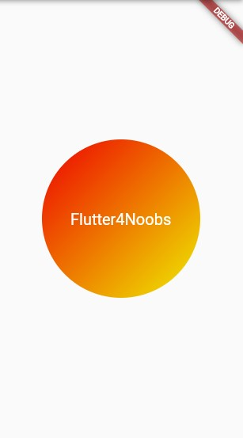

## Container

O container é um dos Widgets mais utilizados nas aplicações. É ele que na maioria das vezes utilizamos para criar cards, formatos, botões personalizados, dimensionamentos, posicionamentos, artes dentre várias outras possibilidades que temos.
Nele podemos determinar uma altura, uma largura, cor, bordas (tamanho da borda, cor, arredondamento da borda...), gradiente, espaçamento para dentro (padding) ou para fora (margin), sombreamento... São várias possibilidades!

Exemplo de um Container:

```dart
// OBS: Lembre-se que ao passar o mouse por cima dos atríbutos ou das classes/Widgets, você pode ver os parâmetro que recebe e o tipo de retorno

final estiloTexto = TextStyle(
    color: Colors.white,
    fontSize: 20,
  );

Container(
    height: 200,
    width: 200,
    alignment: Aligment.center, // aqui estamos definindo a centralização dos elementos filhos do container
    child Text('Flutter4Noobs', style: estiloTexto), // o conteúdo (elementos filhos) do Container é apenas um texto escrito 'Flutter4Noobs'
    decoration: BoxDecoration(
        shape: BoxShape.circle, // formato do container
        gradient: LinearGradient(
            begin: Alignment.topRight,
            end: Alignment.bottomLeft
            colors: <Color>[
                Color(0xffee0000),
                Color(0xffeeee00)
              ],
        ),
    ),
    /*
    OBS: Ao colocarmos o mouse por cima da classe Colors quando estamos utilizando alguma cor, podemos ver uma paleta de cores contendo a intensidade de cada uma.

    Exemplo:
    Colors.purple[300] => estamos pegando a cor roxa na intensidade 300.
    */
),
```

<b>Resultado:</b> </br>

