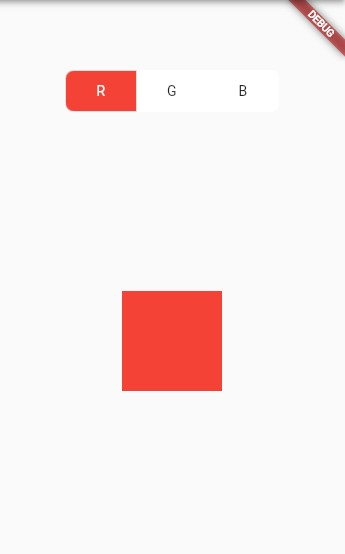
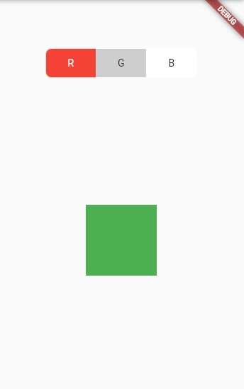
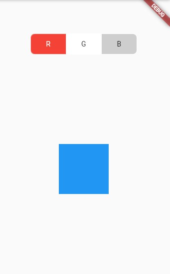
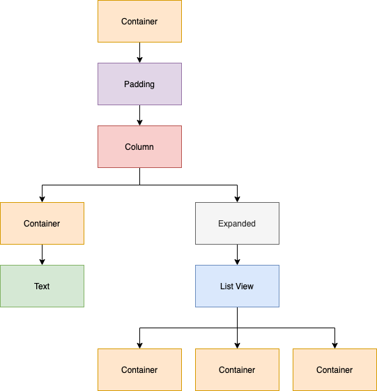

# ListView

<b>O ListView `comum`</b>

O ListView, por padrão, tem um funcionamento semelhante à Column. No entanto, este já vem com um `ScrollView` "embutido". Permitindo que os Widgets filhos (atribuídos ao `children`) possam ser "scrollados". <br>
Podemos inclusive mudar a física desse scroll com o atríbuto `physics` e, também, podemos determinar a direção desse scroll com o atríbuto `scrollDirection`.

```dart
Widget build(BuildContext context) {
    return Scaffold(
      body: ListView(
        physics: BouncingScrollPhysics(),
        scrollDirection: Axis.vertical,
        children: [
          Container(
            height: 200,
            width: 200,
            color: Colors.green,
          ),
          Container(
            height: 200,
            width: 200,
            color: Colors.red,
          ),
          Container(
            height: 200,
            width: 200,
            color: Colors.blue,
          ),
        ],
      ),
    );
  }
```


<br>
<br>

<b>O ListView `builder`</b>

O `ListView.builder()`, diferente do comum, não recebe um children com vários Widgets. Na verdade, ele é como uma otimização. <br>
Se traduzirmos, builder é referente a um construtor. Basicamente, o ListView.builder() "constrói" a sua lista de Widgets da forma que você desejar.

E como isso funciona? ---> Basta utilizarmos o atríbuto `itemBuilder`, que recebe uma `Function(BuildContext context, int index)`, permitindo construirmos o formato do retorno dessa lista.

```dart
   List<Color> cores = [
     Colors.purple,
     Colors.purpleAccent,
     Colors.pink,
     Colors.pinkAccent,
     Colors.blue,
     Colors.blueAccent,
     Colors.blueGrey,
   ];

  @override
  Widget build(BuildContext context) {
    return Scaffold(
      body: ListView.builder(
        physics: BouncingScrollPhysics(),
        scrollDirection: Axis.vertical,
        itemCount: cores.length,
        itemBuilder: (context, index) {
          return Container(
            height: 90,
            width: 90,
            decoration: BoxDecoration(
              color: cores[index],
              shape: BoxShape.circle,
            ),
          );
        }
      ),
    );
  }
}
// Como podem ver, o retorno do itemBuilder é apenas um Container. Percebe que no itemCount passamos o tamanho da lists "cores"? Então, serão exibidos na ListView a mesma quantidade de elementos dessa lista e todos esses elementos serão Containers da mesma forma que foi informada no retorno do itemBuilder. Podemos utilizar o index para percorrer essa lista e atribuir cada cor para cada Container.
```


<br>
<br>

<b>O ListView `separated`</b>

O `ListView.separated()` funciona da mesma forma que o `ListView.builder()`, porém este permite colocarmos um divisor a cada item utilizando o atríbuto `separatorBuilder`, que também recebe um (BuildContext context, int index).

```dart
final List<String> entries = <String>['A', 'B', 'C'];
final List<int> colorCodes = <int>[600, 500, 100];

ListView.separated(
  padding: const EdgeInsets.all(8),
  itemCount: entries.length,
  itemBuilder: (context, index) {
    return Container(
      height: 50,
      color: Colors.amber[colorCodes[index]],
      child: Center(child: Text('Entry ${entries[index]}')),
    );
  },
  separatorBuilder: (context, index) => const Divider(),
);
```


<br>
<br>

# GridView

<b>O GridView `comum`</b>

O GridView, assim como a ListView, possui um `children`, onde pode receber uma lista de Widgets. Porém, a forma de organização de uma GridView é um pouco diferente.

Os Widgets atribuídos ao children são organizados em forma de `grade`.

Além disso, a GridView depende de um atríbuto chamado `gridDelegate` que depende de uma classe chamada `SliverGridDelegate`. Dadas as restrições na grade (informando espaçamento, quantidade de itens por eixo, tamanho...), um SliverGridDelegate calcula o layout de forma igual (baseado no que foi informado no gridDelegate) para cada "bloco" de Widget na grade.

O `gridDelegate` pode receber duas classes do tipo `SliverGridDelegate`:

- `SliverGridDelegateWithFixedCrossAxisCount`, que cria um layout com um número fixo de "blocos" de Widget no eixo transversal.
- `SliverGridDelegateWithMaxCrossAxisExtent`, que cria um layout com "blocos" de Widget que têm uma extensão máxima do eixo transversal.

```dart
  List cores = <Color>[
    Colors.red,
    Colors.green,
    Colors.blue,
    Colors.grey,
    Colors.pink,
    Colors.yellow,
    Colors.purple,
    Colors.amber,
    Colors.lime,
    Colors.greenAccent,
  ];

  @override
  Widget build(BuildContext context) {
    return Scaffold(
      body: Center(
        child: GridView(
          gridDelegate: SliverGridDelegateWithFixedCrossAxisCount(
            crossAxisCount: 2, // Aqui determinamos a quantidade de colunas queremos na nossa grade
            childAspectRatio: 1.5, // Aqui estamos dando uma proporção de tamanho para cada filho que vai ser gerado
          ),
          children: [
            for (var i = 0; i < 10; i++)
              Container(
                height: 60,
                width: 60,
                color: cores[i],
              ),
          ],
        ),
      ),
    );
  }
```


<br>
<br>

<b>O GridView `builder`</b>

Assim como o `ListView`, o GridView também possui o método `builder`. Sua função, então, é similar. Como já foi explicado, a diferença do GridView para o ListView está em seu <b>comportamento</b>!

Então, se no GridView comum podemos passar vários Widgets para uma lista, o já conhecido atributo `children`, sabemos que o atributo `itemBuilder` facilita a nossa vida nesse quesito! Pois permite gerarmos a `Grid` que queremos apenas informando como queremos que ela seja construída. É como um `.map()`: você informa como quer que cada objeto na grade seja construído e ele mapeia pela grade inteira baseada no tipo de conteúdo que está sendo utilizado para isso `(ex: uma List, um Map<>...)`.

E, assim como no `ListView.builder`, o atributo `itemBuilder` também é uma `Function(BuildContext context, int index)`.

```dart
   List<Map<String, dynamic>> dayManagement = [
     {'dia': 'Segunda', 'status': true},
     {'dia': 'Terça', 'status': true},
     {'dia': 'Quarta', 'status': true},
     {'dia': 'Quinta', 'status': true},
     {'dia': 'Sexta', 'status': true},
     {'dia': 'Sábado', 'status': true},
     {'dia': 'Domingo', 'status': true},
   ];

  @override
  Widget build(BuildContext context) {
    return Scaffold(
      body: Center(
        child: GridView.builder(
        shrinkWrap: true,
        padding: EdgeInsets.only(bottom: 70),
        physics: NeverScrollableScrollPhysics(),
        itemCount: 7,
        gridDelegate: SliverGridDelegateWithFixedCrossAxisCount(
          crossAxisCount: 3,
          crossAxisSpacing: .2,
          childAspectRatio: 2.05,
        ),
        // No itemBuilder, eu informo como quero que cada "bloco" da minha grade seja construído.
        itemBuilder: (context, index) => Row(
          mainAxisAlignment: MainAxisAlignment.spaceEvenly,
          children: [
            Text(dayManagement[index]['dia']),
            dayManagement[index]['dia'].length >= 7
                ? SizedBox(width: 6)
                : SizedBox.shrink(),
            Container(
              height: 24,
              width: 42,
              child: CupertinoSwitch(
                  activeColor: Colors.purple,
                  value: dayManagement[index]['status'],
                  onChanged: (value) {
                    setState(() {
                      dayManagement[index]['status'] = value;
                    });
                  },
                )
            ),
          ],
        ),
        // Resumindo, é como se eu estivesse dizendo que quero que CADA bloco/divisão da minha grade seja uma linha (Row) que possui um texto (Text) e um Switch (CupertinoSwitch). Aí, para exibição das informações, utilizei a lista criada anteriormente e fui mapeando usufruindo do index fornecido pelo itemBuilder.
    ),
      ),
    );
  }
```


<br>
<br>

# PageView

Bom, assim como ListView e o GridView, o `PageView` também tem seu tipo de comportamento e sua devida utilidade. E, para ser sincero, é a mais diferenciada entre os Widgets citados anteriormente.

Basicamente, o PageView trabalha com páginas! Podemos utilizar Widgets ou telas mais estruturadas e colocarmos num PageView, associá-lo a algum `controller` e manipular a passagem das páginas com uma `TopBar`, `BottomBar` ou qualquer outra coisa caso queira usar a criatividade.

<p align='center'>
  <b>
    <i>
      O código abaixo possui um nível de complexidade `um pouquinho` só mais elevado que os vistos anteriormente. Porém, se trata mais de costumização do que a estrutura que veremos aqui.
      <p>
      O foco mesmo está no controle e implementação da PageView.
    </i>
  </b>
</p>

```dart
Widget build(BuildContext context) {
    int? pageIndex = 0; // variável dos índices das páginas

    final _pageController = PageController(initialPage: 0);
    // controller das páginas

    List<bool> _selections = [true, false, false]; // lista de bool para mapeamento dos botões

    List<Color> _cores = [Colors.red, Colors.green, Colors.blue];

    return Scaffold(
      body: Column(
        // Essa Column vai ser importante. Não para o PageView em si, pelo menos não diretamente. Mas sim para um conceito que será explicado no próximo tópico. >>> [Bônus] <<<
        crossAxisAlignment: CrossAxisAlignment.center,
        children: [
          IntrinsicWidth(
            // Toda essa estrutura cria o Widget que irá auxiliar na navegação do PageView
            child: Container(
              margin: const EdgeInsets.only(top: 70),
              decoration: BoxDecoration(
                color: Colors.white,
                borderRadius: BorderRadius.circular(8),
              ),
              child: ToggleButtons(
                children: <Widget>[
                  // Aqui cada um dos Widgets da lista é um conteúdo de botão. Ou seja: Cada Widget cria um novo botão com esse conteúdo
                  Text('R'),
                  Text('G'),
                  Text('B'),
                ],
                borderRadius: BorderRadius.circular(8),
                constraints: BoxConstraints(minWidth: 70, minHeight: 40),
                disabledColor: Colors.white,
                selectedColor: Colors.white,
                borderColor: Colors.transparent,
                fillColor: _cores[pageIndex],
                onPressed: (int index) {
                  // condições para mudar o íncide da página ao clicar em um dos botões
                  if (pageIndex == index) {
                    setState(() {
                      _selections[index] = true;
                    });
                  } else{
                    setState(() {
                      _selections[index] = false;
                    });
                  }
                  _pageController.animateToPage(index,
                      duration: Duration(milliseconds: 400),
                      curve: Curves.easeInOut);
                },
                isSelected: _selections,
              ),
            ),
          ),
          SizedBox(height: 16),
          Expanded(
            child: // Lembre-se de colocar o PageView dentro de um Expanded
          ),
        ],
      ),
    );
}
```

Agora vamos para o PageView:

```dart
PageView(
  controller: _pageController,
  physics: NeverScrollableScrollPhysics(), // Nunca [scrollar] utilizando o mouse/dedo para o lado
  onPageChanged: (index) {
    setState(() {
      pageIndex = index;
      // trocando os índices das páginas
    });
  },
  children: [
    // Página 1 (pageIndex = 0)
    Center(
      child: Container(height: 100, width: 100, color: Colors.red),
    ),

    // Página 2 (pageIndex = 1)
    Center(
      child:
          Container(height: 100, width: 100, color: Colors.green),
    ),

    // Página 3 (pageIndex = 2)
    Center(
      child: Container(height: 100, width: 100, color: Colors.blue),
    ),
  ],
),
```

Perceba que nós utilizamos uma variável que armazena os índices das páginas. Assim, podemos utilizar funções para alterá-las e trocasmos de página.
Além disso, o PageView utiliza um `PageController` para poder auxiliar na troca de páginas.





Tá, mas... Por qual motivo colocamos o PageView dentro de um Widget `Expanded`, sendo que não fizemos o mesmo com o `ListView` e o `GridView`?

Bom, isso nos abre espaço para um tópico `bônus`!

# O Expanded em conjunto ao ListView, GridView e PageView

Primeiramente: Não importa o tipo de Widget (se é o List, Grid ou Page), mas sim a situação que estão inseridos.

Se olharmos de novo, veremos que tanto o ListView quanto o GridView estão dentro apenas de um `Center()`. E não há nada de especial no Center a não ser....... centralizar 😃. Esse Widget não trabalha com múltiplos filhos ou com questão de comportamentos de disposição de Widgets na tela.

E o que seria esse algo de `especial` que fez com que precisassemos utilizar o `Expanded` na PageView?

`A Column`!!!

<p align='center'>
  
</p>

Não só a Column, mas acho que lendo isso você já consegue associar que também seria necessário caso utilizassemos uma Row no lugar, por exemplo.

Tá... Mas por quê?

Justamente pelo motivo da Column ser um Widget que permite um tamanho `ilimitado`! Você pode colocar infinitos Widgets dentro de uma Column (apesar de que se você fizer isso sem uma ScrollView, sua tela irá quebrar). Então, se colocarmos o List, Grid ou PageView dentro de uma Column, sem `controlar` essa expansão que ela possa vir a ter, poderemos ter um erro na nossa tela.

Esse controle da expansão é feito justamente com um Widget chamado `Expanded`, que expande ao máximo que puder e passa um limite para seu `child`. Assim, podemos usar o tamanho restante da tela e passar um limitador para as Views.
