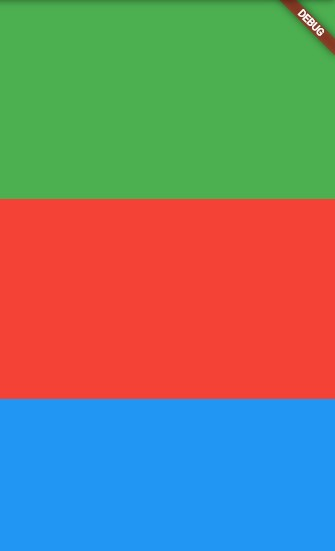
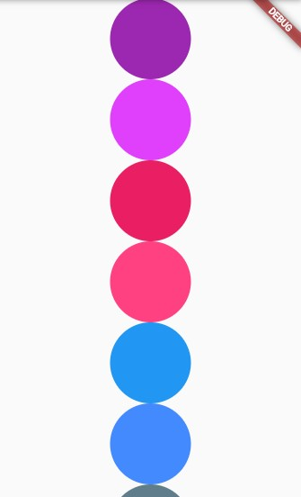
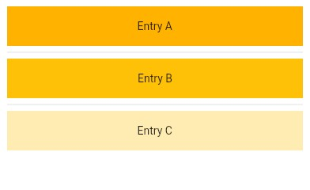
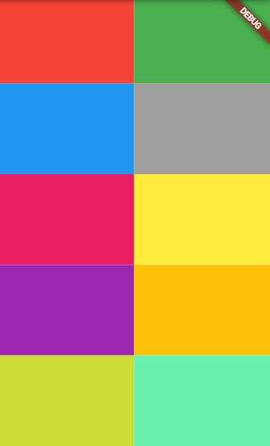
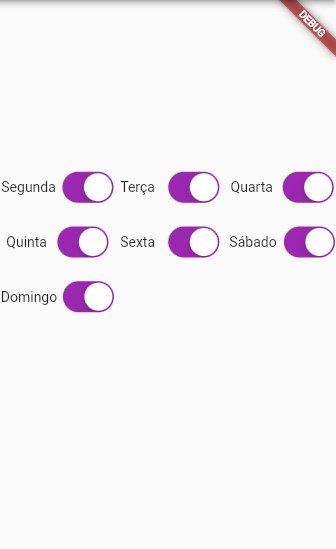

# ListView

<b>O ListView `comum`</b>

O ListView, por padrão, tem um funcionamento semelhante à Column. No entanto, este já vem com um `ScrollView` "embutido". Permitindo que os Widgets filhos (atribuídos ao `children`) possam ser "scrollados". <br>
Podemos inclusive mudar a física desse scroll com o atríbuto `physics` e, também, podemos determinar a direção desse scroll com o atríbuto `scrollDirection`.

```dart
Widget build(BuildContext context) {
    return Scaffold(
      body: ListView(
        physics: BouncingScrollPhysics(),
        scrollDirection: Axis.vertical,
        children: [
          Container(
            height: 200,
            width: 200,
            color: Colors.green,
          ),
          Container(
            height: 200,
            width: 200,
            color: Colors.red,
          ),
          Container(
            height: 200,
            width: 200,
            color: Colors.blue,
          ),
        ],
      ),
    );
  }
```



<br>
<br>

<b>O ListView `builder`</b>

O `ListView.builder()`, diferente do comum, não recebe um children com vários Widgets. Na verdade, ele é como uma otimização. <br>
Se traduzirmos, builder é referente a um construtor. Basicamente, o ListView.builder() "constrói" a sua lista de Widgets da forma que você desejar.

E como isso funciona? ---> Basta utilizarmos o atríbuto `itemBuilder`, que recebe uma `Function(BuildContext context, int index)`, permitindo construirmos o formato do retorno dessa lista.

```dart
   List<Color> cores = [
     Colors.purple,
     Colors.purpleAccent,
     Colors.pink,
     Colors.pinkAccent,
     Colors.blue,
     Colors.blueAccent,
     Colors.blueGrey,
   ];

  @override
  Widget build(BuildContext context) {
    return Scaffold(
      body: ListView.builder(
        physics: BouncingScrollPhysics(),
        scrollDirection: Axis.vertical,
        itemCount: cores.length,
        itemBuilder: (context, index) {
          return Container(
            height: 90,
            width: 90,
            decoration: BoxDecoration(
              color: cores[index],
              shape: BoxShape.circle,
            ),
          );
        }
      ),
    );
  }
}
// Como podem ver, o retorno do itemBuilder é apenas um Container. Percebe que no itemCount passamos o tamanho da lists "cores"? Então, serão exibidos na ListView a mesma quantidade de elementos dessa lista e todos esses elementos serão Containers da mesma forma que foi informada no retorno do itemBuilder. Podemos utilizar o index para percorrer essa lista e atribuir cada cor para cada Container.
```



<br>
<br>

<b>O ListView `separated`</b>

O `ListView.separated()` funciona da mesma forma que o `ListView.builder()`, porém este permite colocarmos um divisor a cada item utilizando o atríbuto `separatorBuilder`, que também recebe um (BuildContext context, int index).

```dart
final List<String> entries = <String>['A', 'B', 'C'];
final List<int> colorCodes = <int>[600, 500, 100];

ListView.separated(
  padding: const EdgeInsets.all(8),
  itemCount: entries.length,
  itemBuilder: (context, index) {
    return Container(
      height: 50,
      color: Colors.amber[colorCodes[index]],
      child: Center(child: Text('Entry ${entries[index]}')),
    );
  },
  separatorBuilder: (context, index) => const Divider(),
);
```



<br>
<br>

# GridView

<b>O GridView `comum`</b>

```dart
  List cores = <Color>[
    Colors.red,
    Colors.green,
    Colors.blue,
    Colors.grey,
    Colors.pink,
    Colors.yellow,
    Colors.purple,
    Colors.amber,
    Colors.lime,
    Colors.greenAccent,
  ];

  @override
  Widget build(BuildContext context) {
    return Scaffold(
      body: Center(
        child: GridView(
          gridDelegate: SliverGridDelegateWithFixedCrossAxisCount(
            crossAxisCount: 2,
            childAspectRatio: 1.5,
          ),
          children: [
            for (var i = 0; i < 10; i++)
              Container(
                height: 60,
                width: 60,
                color: cores[i],
              ),
          ],
        ),
      ),
    );
  }
```



<br>
<br>

<b>O GridView `builder`</b>

```dart
   List<Map<String, dynamic>> dayManagement = [
     {'dia': 'Segunda', 'status': true},
     {'dia': 'Terça', 'status': true},
     {'dia': 'Quarta', 'status': true},
     {'dia': 'Quinta', 'status': true},
     {'dia': 'Sexta', 'status': true},
     {'dia': 'Sábado', 'status': true},
     {'dia': 'Domingo', 'status': true},
   ];

  @override
  Widget build(BuildContext context) {
    return Scaffold(
      body: Center(
        child: GridView.builder(
        shrinkWrap: true,
        padding: EdgeInsets.only(bottom: 70),
        physics: NeverScrollableScrollPhysics(),
        itemCount: 7,
        gridDelegate: SliverGridDelegateWithFixedCrossAxisCount(
          crossAxisCount: 3,
          crossAxisSpacing: .2,
          childAspectRatio: 2.05,
        ),
        itemBuilder: (context, index) => Row(
          mainAxisAlignment: MainAxisAlignment.spaceEvenly,
          children: [
            Text(dayManagement[index]['dia']),
            dayManagement[index]['dia'].length >= 7
                ? SizedBox(width: 6)
                : SizedBox.shrink(),
            Container(
              height: 24,
              width: 42,
              child: CupertinoSwitch(
                  activeColor: Colors.purple,
                  value: dayManagement[index]['status'],
                  onChanged: (value) {
                    setState(() {
                      dayManagement[index]['status'] = value;
                    });
                  },
                )
            ),
          ],
        ),
    ),
      ),
    );
  }
```



<br>
<br>

# PageView
