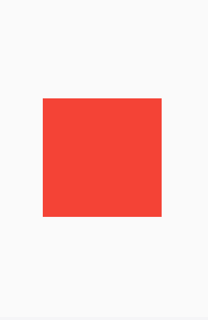
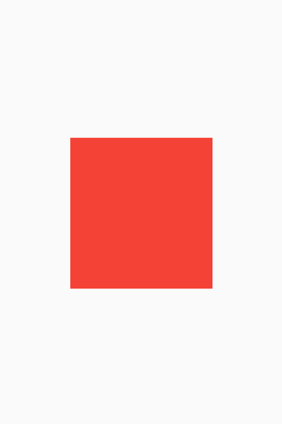

# MediaQuery

## Contextualizando

Quando se está criando um App multiplataforma, estamos nos arriscando a publicá-lo para dispositivos de diversos tamanhos. Ou seja, diversas dimensões de telas.

Convenhamos que se criarmos um App para dispositivos smartphones, tablets, Smart TVs e Desktops teremos diversos tamanhos de telas. Você muito provavelmente já teve a experiência de utilizar um aplicativo no seu celular e também usá-lo em sua Smart TV, e talvez tenha notado que existe uma diferença em como esse aplicativo é disposto na tela. Algumas opções ficam mais expostas, outras nem tanto, algumas em outro canto. Isso acontece por conta da necessidade de ADAPTAÇÃO do aplicativo à tela daquele dispositivo.

Chamamos essa adaptação às telas de `responsividade` (o que de certa forma também é uma `adaptabilidade`), e é algo que você, futuro desenvolvedor mobile, terá de lidar.

Um exemplo bem simples de adaptação de layout ocorre no próprio YouTube! Perceba que em seu aplicativo mobile você precisa clicar em um ícone de lupa para abrir a caixinha de pesquina. Já em sua plataforma Web, temos a caixa de pesquina no topo, aberta, livre para digitarmos algo de imediato. Isso acontece pois muito provavelmente foi uma decisão tomada para que esse componente tivesse essa visualização e esse comportamento nas diferentes telas para qual fosse melhor adaptado.

## O que é o MediaQuery

O MediaQuery fornece uma visualização de nível superior do tamanho da tela do dispositivo no qual estamos acessando o aplicativo e também pode nos dar informações mais detalhadas não apenas do dispositivo mas também de suas preferências de layout, permitindo que o usuário possa adaptar seu aplicativo a essas preferências.

Quando queremos que o MediaQuery pegue as `informações` da tela (ou melhor dizendo, daquele contexto), usamos o método .of(), onde passamos um `context` (BuildContext). Ficando algo como:

```dart
MediaQuery.of(context);
```

O método **.of(BuildContext)** nos dá a classe `MediaQueryData`, que é basicamente um 'informante' dos dados de um componente, ele é quem nos fornece o getter `.size` (classe `Size`).

Tendo as informações daquele contexto podemos pegar agora suas dimensões utilizando o getter `.size`. Temos então:

```dart
MediaQuery.of(context).size;
```

Podemos guardar isso em uma variável:

```dart
final size = MediaQuery.of(context).size;
```

Agora podemos acessar tanto a altura (`height`) quanto a largura (`width`) utilizando os getters de mesmo nome.

```dart
final size = MediaQuery.of(context).size;

Container(
    height: size.height,
    width: size.width,
),
```

## Atualizações do MediaQuery com o Flutter 3.10.x

A partir da versão **3.10.x** do Flutter, o MediaQuery nos fornece uma forma simplificada de acessar as informações de um componente. Não precisamos mais acessar diretamente a classe `MediaQueryData` com o método **.of(BuildContext)** para termos acesso à classe `Size`, agora basta chamarmos o método **.sizeOf(BuildContext)**.
Agora também conseguimos acesso direto à classe `EdgeInsets` (classe utilizada para _paddings_ e _margins_) através do método **.paddingOf(BuildContext)**. Com isso conseguimos informações sobre 'distanciamentos'/'afastamentos' de um Widget em relação a seu Widget ancestral/pai.

### sizeOf(BuildContext)

```dart
final size = MediaQuery.sizeOf(context);
```

Este método retorna diretamente a classe `Size` para que os getters `heigh` e `width` sejam acessados.

Mais sobre o novo método pode ser lido aqui: https://api.flutter.dev/flutter/widgets/MediaQuery/sizeOf.html

### paddingOf(BuildContext)

Mais sobre o novo método pode ser lido aqui: https://api.flutter.dev/flutter/widgets/MediaQuery/paddingOf.html

```dart
final padding = MediaQuery.paddingOf(context);

Widget build(BuildContext context) {
    return Scaffold(
        body: Container(
            padding: padding.copyWith(top: 20),
            decoration: BoxDecoration(
                color: Colors.blue,
                borderRadius: BoderRadius.circular(4),
            ),
        ),
    );
}
```

## Tornando Widgets adaptativos para diferentes tamanhos de telas

Acredito que você deve concordar que um `Container` com 200 de altura e 200 de largura possui esse tamanho de forma exata para TODOS os dispositivos. Matemáticamente, isso é indiscutível, não importa o tamanho da tela: 200 de altura e 200 de altura serão SEMPRE 200 de altura e 200 de largura.

PORÉM!!!

Suponha que você, utilizando o seu emulador (um Pixel 4, por exemplo), colocou no centro da tela um Container de 200x200 e achou que estava ótimo.

Mas... se seu aplicativo também for para uma Smart TV, que, cá entre nós... com certeza possui dimensões BEM diferentes do seu emulador. Então o seu Container de 200x200 vai continuar sendo um Container de 200x200, mas a experiência de quem vai estar vendo esse Container na TV será completamente diferente da de quem está vendo pelo celular. Apesar de manter a dimensão, aparentará ser algo bem pequeno se levarmos em consideração todo o tamanho da TV.

```dart
Container(
    height: 200,
    width: 200,
    color: Colors.red,
),
```



Então, uma forma de solucionarmos isso é determinando que o Container ocupe uma PORCENTAGEM do espaço da tela, não importa em qual dispositivo seja. Com isso, poderemos manter algo muito melhor do que o tamanho: a proporção!

Podemos então apenas definir da seguinte forma:

```dart
final size = MediaQuery.of(context).size;

Container(
    height: size.height * .35,
    width: size.width * .5,
    color: Colors.red,
),
```

Dessa forma estamos dizendo que o Container ocupará 35 % da altura da tela e 50 % da largura da tela.


