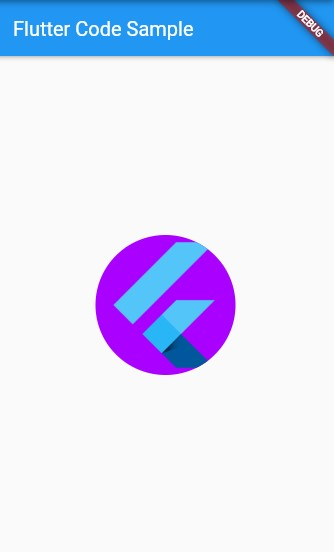

# CircleAvatar

</br>

Esse Widget é bastante utilizado quando queremos colocar formas arredondadas em nosso projeto. Podemos determinar seu raio (mínimo e máximo também), sua cor de fundo, cor de texto e até mesmo uma imagem de fundo!

</br>

```dart
Center(
      child: CircleAvatar(
        radius: 70,
        backgroundImage: NetworkImage('https://d2eip9sf3oo6c2.cloudfront.net/tags/images/000/001/245/thumb/flutterlogo.png'),
      backgroundColor: Colors.purpleAccent[700],
      ),
    );
```

</br>



</br>
</br>

<div align='center'>
    <i>
        Como você pode ver, para esse exemplo foi utilizado uma imagem da internet no Widget do CircleAvatar. Porém, não se preocupe! Nós temos um ártigo explicando como você pode colocar imagens em seus projetos Flutter!
    </i>
</div>

</br>

[Colocando Imagens em Seus Projetos](../colocando_imagens.md)
