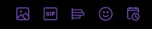
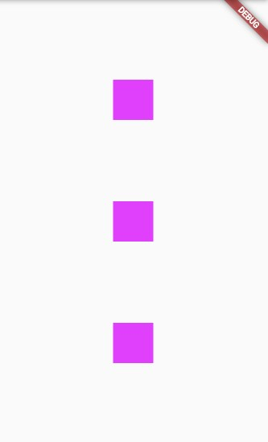

## Column & Row (Coluna e Linha)

Uma coisa muito comum nos apps são linhas e colunas.

Por exemplo: Ícones alinhados (como os ícones de reações nas redes sociais).
<br/> <br/>
Neste caso, provavelmente poderia ter sido feito com uma Row (`linha`), ou com algum componente que permite alinhar os ícones dessa forma.

Mas agora vamos para o código. O que será mostrado são apenas exemplos, nada muito complexo, apenas para o entendimento de como funciona as Columns e as Rows.

MAS, antes, precisamos entender três coisas desses Widgets:

- MainAxisAlignment
- CrossAxisAlignment
- children

<b> > MainAxisAlignment</b>

<div align='center'>
  É o alinhamento <i>principal</i> da Column ou da Row. Pense bem: Qual é a direção do alinhamento principal da Column? É a vertical! Assim como na Row o alinhamento principal está na horizontal. </br>
  Portanto, quando utilizamos o MainAxisAlignment, estamos querendo determinar como será o comportamento desse alinhamento.
</div>

<b> > CrossAxisAlignment</b>

<div align='center'>
  Bom, agora que você sabe que o MainAxisAlignment serve para determinar o comportamento do alinhamento principal da Column ou da Row, nos resta saber sobre o CrossAxisAlignment. </br>
  O conceito é exatamente o mesmo! Porém, se traduzirmos à risca "cross", temos "cruzamento". </br>
  Pense bem: Qual é o alinhamento que CRUZA com o alinhamento principal de uma Coluna? O horizontal! Afinal, o alinhamento principal de uma coluna é o vertical.
  Assim, podemos concluir que o alinhamento que cruza com o principal de uma Linha (Row) é o da vertical.
</div>

> > > Comportamento MainAxis e CrossAxis na Coluna


> > > Comportamento MainAxis e CrossAxis na Linha


<i>OBS: O MainAxisAlignment e o CrossAxisAlignment são atríbutos NÃO obrigatórios</i>

<b> > children</b>

<div align='center'>
  Traduzindo, podemos dizer que estamos nos referindo aos "filhos" da Column ou da Row. 'children' é um atríbuto que recebe uma lista de widgets, podemos passar QUALQUER Widget para essa lista e, como resultado, eles se comportarão conforme o padrão de uma coluna ou uma linha (verticalmente e horizontalmente, respectivamente) + o comportamento do alinhamento determinado no MainAxisAlignment ou CrossAxisAlignment.
</div>

`Coluna (Column)`

```dart
  final cont = Container(
    height: 50,
    width: 50,
    color: Colors.purpleAccent,
  );

  @override
  Widget build(BuildContext context) {
    return Scaffold(
      body: Center(
        child: Column(
          mainAxisAlignment: MainAxisAlignment.spaceEvenly,
          children: [
            cont,
            cont,
            cont,
          ],
        ),
      ),
    );
  }
```

<br/>

<br/><br/>

`Linha (Row)`

```dart
  final cont = Container(
    height: 50,
    width: 50,
    color: Colors.purpleAccent,
  );

  @override
  Widget build(BuildContext context) {
    return Scaffold(
      body: Center(
        child: Row(
          mainAxisAlignment: MainAxisAlignment.spaceEvenly,
          children: [
            cont,
            cont,
            cont,
          ],
        ),
      ),
    );
  }
```

<br/>

<br/><br/>
