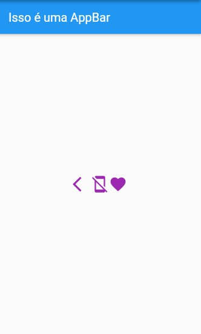
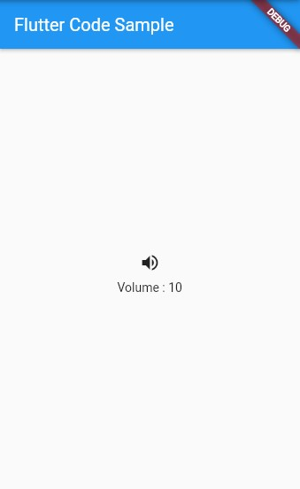

# Icon

Basicamente, como o nome já diz, é um Widget que trabalha com `ícones`! Para ser mais exato, duas classes serão importantes aqui: a `Icon` e a `Icons`.

Basicamente, para chamarmos um ícone em nossa tela, precisamos do Widget `Icon`, que recebe a classe `Icons` e também permite mudarmos cor, tamanho e outras características dos ícones.

```dart
body: Center(
        child: Row(
          mainAxisAlignment: MainAxisAlignment.center,
          children: [
            Icon(Icons.arrow_back_ios, color: Colors.purple, size: 30),
            Icon(Icons.mobile_off, color: Colors.purple, size: 30),
            Icon(Icons.favorite, color: Colors.purple, size: 30),
          ],
        ),
),
```

<div align='center'>
    
</div>

<br>

# IconButton

O `IconButton` é um Widget que tem dois atríbutos principais: o `icon`, que recebe um <b>Icon</b>, e o `onPressed`, que recebe uma <b>Function ()</b>.

Muito provavelmente você já deve ter visto isso em aplicativos do seu dia-a-dia. Quando, por exemplo, clicamos em algum <i>reaction</i> de alguma rede social, ou então quando clicamos nos ícones para mandarmos alguma imagem ou vídeo em algum chat. Ou até mesmo para realizar alguma ação qualquer.

Basicamente, o `IconButton` é um ícone capaz de realizar uma ação.

Vamos para um exemplo por código:

```dart
double _volume = 0.0; // variável que sofrerá a ação realizada pelo IconButton

class MyStatefulWidget extends StatefulWidget {
  @override
  State<MyStatefulWidget> createState() => _MyStatefulWidgetState();
}

class _MyStatefulWidgetState extends State<MyStatefulWidget> {
  @override
  Widget build(BuildContext context) {
    return Column(
      mainAxisSize: MainAxisSize.min,
      children: [
        IconButton(
          icon: Icon(Icons.volume_up), // Passando o Icon como parâmetro para o IconButton
          onPressed: () {
            // No onPressed, a ação determinada foi incrementar a variável _volume em +10.
            setState(() {
              _volume += 10;
            });
            // OBS: Não esqueça de utilizar o setState(() {}) para modificar o estado da variável.
          },
        ),
        Text('Volume : $_volume')
      ],
    );
  }
}
```

 <br>

Após clicar no `IconButton` a ação é feita:
<br>

