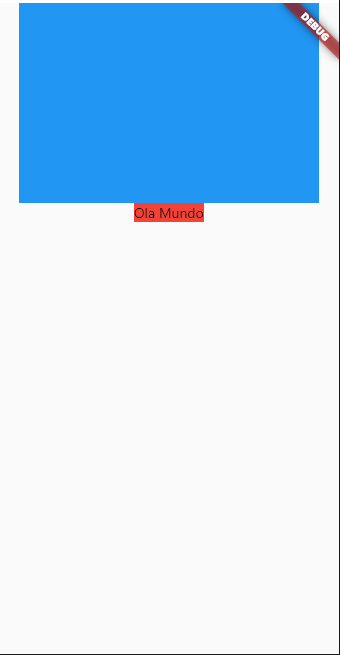

## SizedBox

No flutter SizedBox é um dos Widgets utilizados para criar uma caixa com um tamanho especificado, diferente do Container na qual não é possivel definir uma altura, largura. Seu objetivo é controlar o tamanho do Widget que for definido no ```child:``` do SizedBox.

Seu Construtor:
``const SizedBox({ Key key, this.width, this.height, Widget child })``

Exemplo de um SizedBox:

```dart
    SizedBox(
      height: 200,//Altura
      width: 300,//Largura
      child: Container( //Filho
        color: Colors.blue,
      ), //Container Vai possuir Tamanho 200
    ),
```

Codigo Completo:

```dart
  @override
  Widget build(BuildContext context) {
    return Scaffold(
      body: Center(
        child: Column(
          children: [
            SizedBox(
              height: 200,
              width: 300,
              child: Container(
                color: Colors.blue,
              ), //Container Vai possuir Tamanho 200
            ),
            SizedBox(
              //Se não passar um tamanho ele se reajustara de acordo com seu filho
              child: Container(
                color: Colors.red,
                child: const Text('Ola Mundo'),
              ),
            )
          ],
        ),
      ),
    );
  }
```

<b>Resultado:</b> </br>

