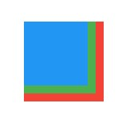

# Stack

Assim como a [Column e a Row](column_row.md), o `Stack` também é um Widget que serve para "organização" de Widgets em um determinado alinhamento.

Se você pensar de uma forma matemática, podemos dizer que o alinhamento principal da coluna (Column) está no `eixo y`, o alinhamento da linha (Row), está no `eixo x` e, portanto, o alinhamento principal da `PILHA`, ou melhor, Stack, está no `eixo z`!

Percebam o destaque na palavra "pilha". Sim, ele foi de propósito. Afinal, o objetivo da Stack é `empilhar os Widgets`. E, assim como a Column e a Row, tem como atríbuto um `children`, que recebe uma lista de Widgets.

```dart
Stack(
  children: [
    Container(
      width: 100,
      height: 100,
      color: Colors.red,
    ),
    Container(
      width: 90,
      height: 90,
      color: Colors.green,
    ),
    Container(
      width: 80,
      height: 80,
      color: Colors.blue,
    ),
  ],
)
```

Como podemos ver, o Widget que é colocado no final é o que está no topo da pilha.

<div align='center'>
<b>CURIOSIDADE</b>

A Stack, por padrão, segue a lógica de estrutura de dados chamada de `L.I.F.O` ("Last in - first out"). Ou seja, o último Widget a ser empilhado é o que, teóricamente, seria o último a sair de uma pilha (pensando em uma situação real).

</div>

</br>

Mas, podemos resumir isso para o fato de que o último Widget a ser empilhado é o que estará no topo dessa pilha.

<div align='center'>
    
</div>
