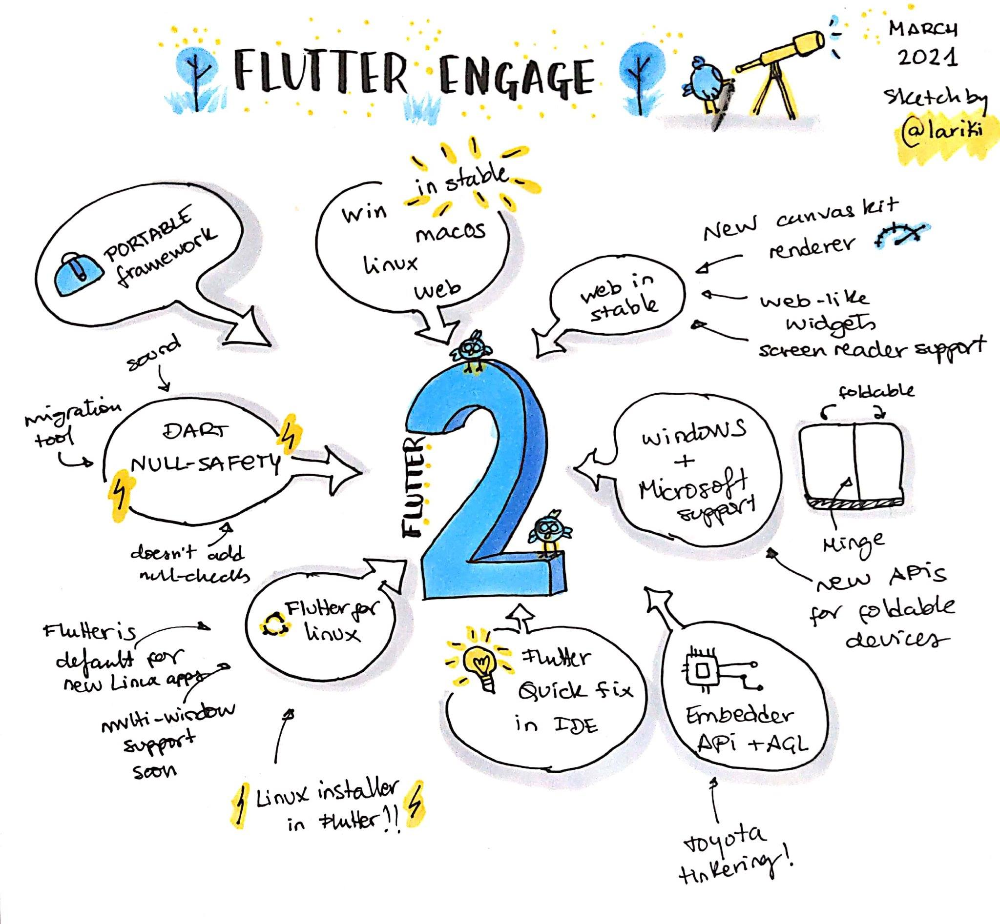

# Flutter 2.0

No dia 03 de Março aconteceu um dos eventos mais esperados pela comunidade do Flutter. O [Flutter Engage](https://www.youtube.com/watch?v=yll3SNXvQCw), onde foi anunciada a nova release da versão estável do Flutter, além de muitas outras novidades.

#

<i> Créditos na imagem </i>

#

Dentre as novidades:

- Flutter Web e Desktop agora fazem parte da versão Stable
- Flutter como tecnologia nativa do Ubuntu e de seu instalador (instalador do Unbutu feito em Flutter)
- Flutter para sistemas embarcados
- Dart Null-Safety
- Widgets próprios para as aplicações Web
- Aplicações agora suportam telas divididas
