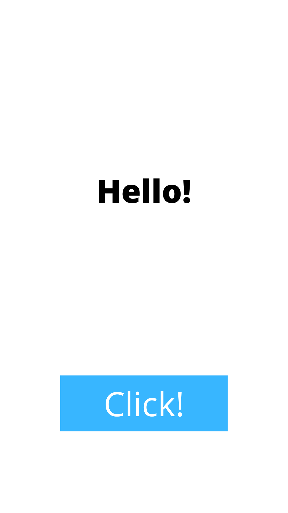
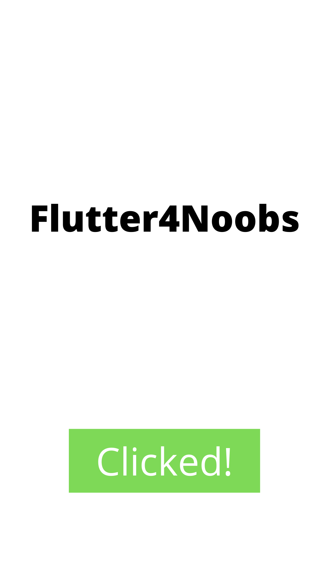

# O setState( ) e o estado de um Widget

No Flutter tudo é Widget. Os botões, textos, colunas, linhas, imagens, são classes que herdam um tipo de Widget. Essas classes herdadas são os já falados [Stateless e Stateful Widgets](../Widgets/stateless_e_stateful_widgets.md).

No entanto, nesta parte do artigo será tratado exclusivamente do tipo de Widget que é capaz de alterar seu estado. O `StatefulWidget`!

## A função setState( )

```dart
class WidgetDeExemplo extends StatefulWidget {
    @override
    State<StatefulWidget> createState() {
        return WidgetDeExemploState();
    }
}

class WidgetDeExemploState extends State<WidgetDeExemplo> {

    String _palavraQualquer = 'Hello!';
    String _textoBotao = 'Click!';
    Color corBotao = Colors.blue;

    @override
    Widget build(BuildContext context) {
        return Column(
            mainAxisAlignment: MainAxisAlignment.spaceEvenly,
            children: [
                Text(_palavraQualquer),
////////// Aqui acontecerá o uso do setState( ) /////////////
                FlatButton(
                    backgroundColor: corBotao,
                    child: Text(_textoBotao),
                    onPressed: () { // o onPressed é um atríbuto do Widget FlatButton, que permite utilizarmos funções ao clicar nele
                        setState(() {  // o setState irá alterar o estado do Text (seu texto) e do FlatButton (seu texto e sua cor)
                            _palavraQualquer = 'Flutter4Noobs';
                            _textoBotao = 'Clicked!';
                            corBotao = Colors.green;
                        });
                    }
                ),
///////////////////////////////////////////////////////// /
            ],
        );
    }
}
```

<p>
    Antes de clicar no botão: <p>
     <p>
    Depois de clicar no botão: <p>
    
</p>
