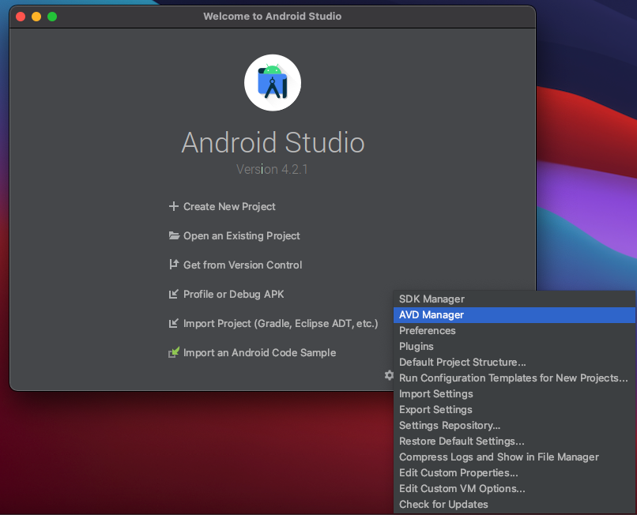
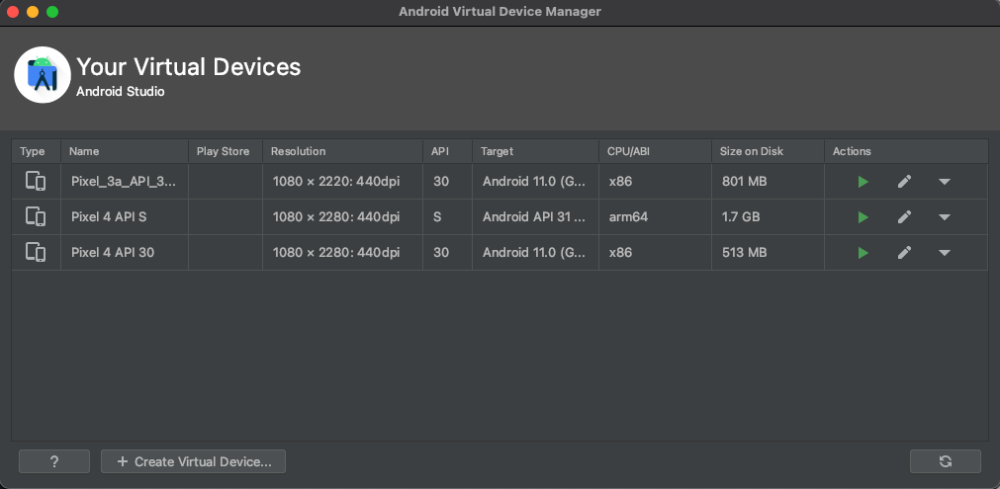

# Instalação do Flutter no MacOS

## Download e Instalação do SDK

O download do SDK do Flutter pode ser feito de 2 maneiras diferentes: baixando o pacote zipado do SDK ou clonando do repositório do Github do Flutter

#### Baixando o .zip
Para baixar o .zip com SDK do Flutter basta acessar o [link](https://flutter.dev/docs/get-started/install/macos#get-sdk) e clicar no botão `flutter_macos_x.y.z-stable.zip` (sendo `x.y.z` a versão do Flutter no momento que você estiver baixando).

Após isso, abra seu terminal e navegue até onde deseja deixar a pasta com o SDK do Flutter e digite o seguinte comando para extrair o .zip:
```
unzip ~/Downloads/flutter_macos_x.y.z-stable.zip
```

#### Clonando o repositório
Para clonar o repositório, navegue pelo terminal até onde deseja deixar a pasta com o SDK do Flutter e digite o seguinte comando:
```
git clone https://github.com/flutter/flutter.git -b stable
```

## Adicionar o Flutter ao PATH do sistema

Para adicionar o Flutter ao PATH do sistema, vá até a pasta de seu usuário(`/Users/'seu_usuario'`) e localize o arquivo .zshrc (caso ele não esteja visível, digite Cmd + Shift + . para exibir os arquivos ocultos).

Após isso, cole o seguinte comando ao final do arquivo:
```
export PATH="$PATH:'caminho'/flutter/bin"
```
em que 'caminho' será o caminho do sistema onde você extraiu o .zip ou deu `git clone`.

## Configurações iOS e Mac
#### Xcode
Para conseguir desenvolver e testar suas aplicações Flutter para iOS será necessário instalar a IDE Xcode da Apple.
Você pode baixá-la no seguinte [link](https://developer.apple.com/xcode/) ou pela App Store.
Após baixar o Xcode, rode os seguintes comandos para fazer sua configuração básica.
```
sudo xcode-select --switch /Applications/Xcode.app/Contents/Developer
sudo xcodebuild -runFirstLaunch
```
Em seguida, rode o seguinte comando para aceitar as licensas do Xcode:
```
sudo xcodebuild -license
```

#### Emulador
Para rodar o emulador padrão do MacOS, basta procurar por "Simulator" no Spotlight(Cmd + Espaço) ou digitar o seguinte comando:
```
open -a Simulator
```

#### Configurações Adicionais
Caso ao longo do seu desenvolvimento você use algum plug-in, que interage com código nativo(Swift), será necessário que você tenha instalado o CocoaPods, que é um gerênciador de dependências para projetos Swift e Objective-C.
Para isso, basta digitar o seguinte comando no seu terminal:
```
sudo gem install cocoapods
```

**OBS:** ao instalar plugins nativos que suportam iOS, é necessário rodar o comando `pod install`. Caso você esteja em um Mac com processador Apple M1 e estiver tendo problemas ao rodar o `pod install`, tente rodar da seguinte maneira: `arch -x86_64 pod install`. O commando `arch` serve para que seja possível rodar comandos x86 por meio do Apple Rosetta 2.

Caso queria utilizar o Flutter para Desktop, basta rodar o comando:
```
flutter config --enable-macos-desktop
```

## Configurações Android
#### Instalação do Android Studio
Para baixar o Android Studio acesse o seguinte [link](https://developer.android.com/studio).
Após isso, basta seguir o fluxo normal de instalação e, assim, você terá, além do Android Studio, o Android SDK, que será necessário para você desenvolver.

Assim como foi necessário aceitar as licenças do Xcode anteriormente, também é necessário aceitar as licenças do Android. Para isso, rode o comando abaixo:
```
flutter doctor --android-licenses
```

#### Emulador
Abra o Android Studio e, no canto inferior direito, clique em Configure → AVD Manager. 

Isso irá uma janela com os emuladores disponíveis para você iniciar e é possível criar um novo emulador no botão "Create Virtual Device", em que há um fluxo simples de selecionar o dispositivo e a versão do Android que ele rodará.


**OBS:** Caso você esteja em um Mac com processador Apple M1 e estiver tendo problemas ao iniciar o emulator, tente baixar o preview do Android Emulator disponibilizado pela Google no seguinte [link](https://github.com/google/android-emulator-m1-preview/releases).

## Pós Instalação

Com todos os passos anteriores feitos, digite em seu terminal o seguinte comando para verificar se a instalação está totalmente correta

```
flutter doctor
```

Esse comando vai te falar se o flutter foi devidamente instalado e se os outros programas recomendados para desenvolvimento de aplicações estão devidamente instalados também.

É recomendado também que você tenha:

- O editor de texto [Visual Studio Code](https://code.visualstudio.com/).
- O [plugin do Flutter](https://marketplace.visualstudio.com/items?itemName=Dart-Code.flutter) para o VSCode.
- O [plugin do dart](https://marketplace.visualstudio.com/items?itemName=Dart-Code.dart-code) para o VSCode.


