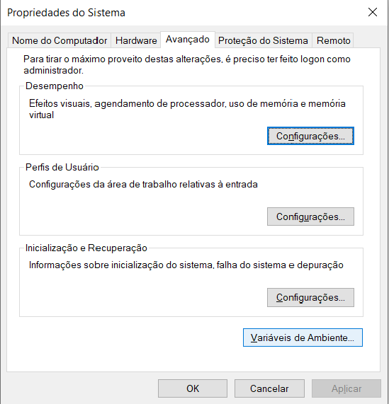
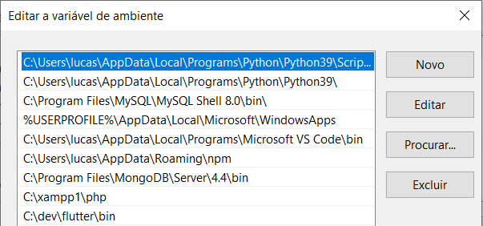

# Instalação do Flutter no Widows

## Download do SDK

Para instalar o Flutter em sua máquina, acesse a documentação oficial do Flutter, vá até a aba de [instalação](https://flutter.dev/docs/get-started/install/windows) e faça o download do SDK do Flutter.

## Instalação do SDK

Após fazer o download do SDK como orientado acima, você deve extrair o arquivo .zip que foi baixado. Ao extrair, você terá uma pasta chamada "flutter".
Os próximos passos são para adicionar o flutter ao PATH do sistema, para você conseguir utilizar as ferramentas de linha de comando do flutter.

## Adicionar o Flutter ao PATH do sistema

Esse passo é extremamente importante, para deixar seus diretórios de forma organizada, eu recomendo que crie uma pasta na raiz de seu sistema (C:) chamada dev, após isso, mova a pasta "flutter" para essa pasta dev.
<br>
<br>
Agora basta copiar o caminho do diretório atual, no meu caso é <b>C:\dev\flutter</b>

Abra o menu iniciar e pesquise por "Editar variáveis de ambiente do sistema" e vá em "Variáveis de Ambiente"
<br>
<br>
<p align='center'>

</p>

Após isso, vá em "PATH" e selecione a opção editar, para conseguir adicionar o caminho da pasta do flutter

Então vá em "Novo" e apenas adicione o caminho da pasta selecionada anteriormente, ficando mais ou menos dessa forma:
<br>
<br>
<p align='center'>

</p>

## Verificar se o Flutter está devidamente instalado

Agora é importante verificar se tudo está funcionando. Rode em seu terminal o comando:

```
flutter doctor
```

Esse comando vai te falar se o flutter foi devidamente instalado e se os outros programas recomendados para desenvolvimento de aplicações estão instalados também.

Uma das coisas que ele provavelmente irá apontar, é que você não aceitou as licensas necessárias para o desenvolvimento com android, para isso apenas rode o comando:
```
flutter doctor --android-licenses
```
E aceite os termos utilizando a tecla <b>Y</b> quando for solicitado

É recomendado também que você tenha:

- 1 O editor de texto [Visual Studio Code](https://code.visualstudio.com/)
- 2 O [plugin do Flutter](https://marketplace.visualstudio.com/items?itemName=Dart-Code.flutter) para o VSCode
- 3 O [plugin do dart](https://marketplace.visualstudio.com/items?itemName=Dart-Code.dart-code) para o VSCode
- 4 O Emulador de Android [Android Studio](https://developer.android.com/studio)


