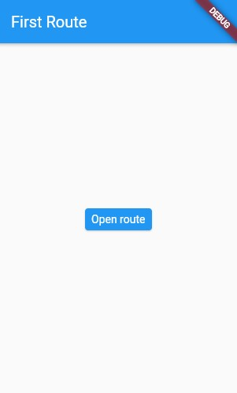
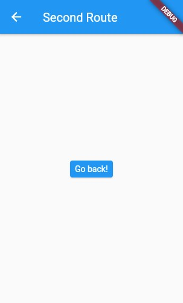

# Formas de Navegar entre Telas no Flutter

Existem algumas formas de navegar entre as telas de um aplicativo.

<div align='center'>
    <u>
    <i>
    Gostaria de abrir um parêntese aqui para que primeiro levemos em consideração uma diferença quanto ao MaterialApp e o CupertinoApp, pois os dois podem apresentar animações de transição diferentes. <br/>
    Irei tratar disso mais adiante nesse artigo.
    </i>
    </u>
</div>
<br/>
<b>
    Obs: Fique de olho nos comentários dos códigos ^-^
<b/>

---

## Navegando para uma tela e voltando

```dart
class PrimeiraRota extends StatelessWidget {
  @override
  Widget build(BuildContext context) {
    return Scaffold(
      appBar: AppBar(
        title: Text('First Route'),
      ),
      body: Center(
        child: ElevatedButton(
          child: Text('Open route'),
          onPressed: () {
              // O método push permite nos levar para uma outra página.
            Navigator.push(
              context,
              MaterialPageRoute(builder: (context) => SegundaRota()),
            );
            /* Estrutura do Navigator.push():
            1 - Recebe o context (BuildContext) da nossa tela
            2 - Utiliza-se a classe MaterialPageRoute para passar o context no construtor (builder), `retornando` para nós a tela que queremos ir.
            3 - Em builder: (context) => TelaQueQueremos(). Você deve utilizar o nome da classe da tela que deseja ir, não importando se extende um Stateless ou StatefulWidget.
            4 - Lembre-se: No flutter, as telas também são Widgets.
            5 - Vale lembrar que o método push coloca a página que queremos ir por cima da atual, mas não fecha/substitui a atual.
            */
          },
        ),
      ),
    );
  }
}

class SegundaRota extends StatelessWidget {
  @override
  Widget build(BuildContext context) {
    return Scaffold(
      appBar: AppBar(
        title: Text("Second Route"),
      ),
      body: Center(
        child: ElevatedButton(
          onPressed: () {
            Navigator.pop(context);
            /*
            Lembra que eu falei que o método .push() coloca a tela que queremos ir sobre a atual? Então. Quando utilizamos o método .pop() nós podemos perceber isso!
            Mas como?
            Como pode ver, no método pop só passamos o context, não precisamos informar a página que queremos voltar. Isso justamente porque a tela SegundaRota() está por cima da tela PrimeiraRota(). Portanto, ao utilizarmos o pop(), retiramos a tela SegundaRota() de cima da PrimeiraRota().
            Imagine esse processo como se tivessemos empilhado as páginas.
            */
          },
          child: Text('Go back!'),
        ),
      ),
    );
  }
}
```

<div align='left'>
     
<div/>

---

## Navegando entre rotas nomeadas

```dart
void main() {
  runApp(MaterialApp(
    title: 'Rotas Nomeadas',
    initialRoute: '/',
    // Por padrão a rota principal do nosso app vem como '/'
    routes: {
      '/': (context) => FirstScreen(),
      '/segunda': (context) => SecondScreen(),
    },
  ));
}
// routes recebe um Map<String, dynamic> onde as chaves são as rotas (sempre com '/' antes do nome) e os valores são as telas pertencentes àquela rota.
/*
Seguindo então esse formato:
'/nome_rota': (context) => TelaDesejada(),

Com isso, o Flutter já entendente que aquela rota direciona para aquela página.
*/


class PrimeiraTela extends StatelessWidget {
  @override
  Widget build(BuildContext context) {
    return Scaffold(
      appBar: AppBar(
        title: Text('Primeira tela'),
      ),
      body: Center(
        child: ElevatedButton(
          child: Text('Ir para próxima tela'),
          onPressed: () {
            Navigator.pushNamed(context, '/segunda');
          },
        ),
      ),
    );
  }
}

class SegundaTela extends StatelessWidget {
  @override
  Widget build(BuildContext context) {
    return Scaffold(
      appBar: AppBar(
        title: Text("Segunda tela"),
      ),
      body: Center(
        child: ElevatedButton(
          onPressed: () {
            Navigator.pop(context);
          },
          child: Text('Voltar!'),
        ),
      ),
    );
  }
}
```

<div align='left'>
     
<div/>
