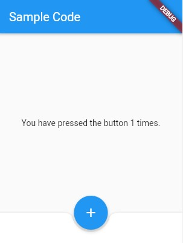

# Scaffold

Antes de criar qualquer tela no Flutter, tem um Widget que nos fornece o básico. Esse Widget é o `Scaffold`. Nele podemos já implementar o corpo da nossa tela (o `body`), uma [AppBar](../../Dando_alguns_passos/appbar/appbar.md), uma `BottomNavigationBar`, um `Drawer`, um `FloatingActionButton`, dentre outras coisas. É como se fosse um modelo de layout pré pronto para apenas customizarmos da forma que quisermos.

```dart
class MyStatefulWidget extends StatefulWidget {
  const MyStatefulWidget({Key? key}) : super(key: key);

  @override
  State<MyStatefulWidget> createState() => _MyStatefulWidgetState();
}

class _MyStatefulWidgetState extends State<MyStatefulWidget> {
  int _count = 0;

  @override
  Widget build(BuildContext context) {
    return Scaffold(
      appBar: AppBar(
        title: const Text('Sample Code'),
      ),
      body: Center(
        child: Text('You have pressed the button $_count times.'),
      ),
      bottomNavigationBar: BottomAppBar(
        shape: const CircularNotchedRectangle(),
        child: Container(height: 50.0),
      ),
      floatingActionButton: FloatingActionButton(
        onPressed: () => setState(() {
          _count++;
        }),
        child: const Icon(Icons.add),
      ),
      floatingActionButtonLocation: FloatingActionButtonLocation.centerDocked,
    );
  }
}
```



O Scaffold possui uma facilidade de se reconstruir (`rebuild`) com determinadas ações. Um exemplo disso é quando chamamos um teclado na nossa tela. O Scaffold irá automaticamente ser reconstruído se adaptando ao espaço que foi ocupado pelo teclado.
Caso queiramos desabilitar essa funcionalidade, basta colocarmos o `resizeToAvoidBottomInset` para <b>false</b>.
