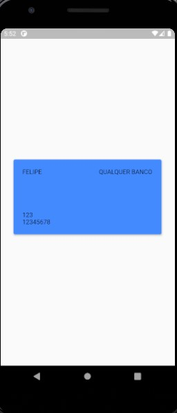
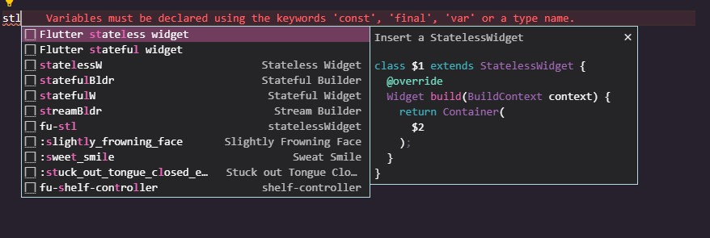
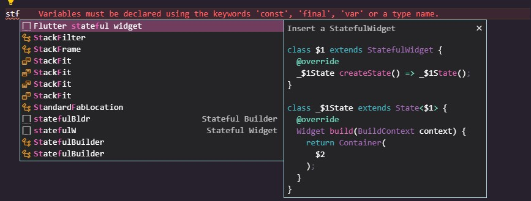

# Stateless e Sateful Widgets

No Flutter, nossos Widgets apresentam estados. Para ser mais específico: os Widgets podem <i> `extender` </i> (herdar) classes que determinam se eles podem ou não mudar de estado.

## Stateless Widgets

Classes que extendem o que chamamos de StatelessWidget nunca mudam o seu estado.

Por exemplo: Widgets como Text e Icon, seus estados nunca mudam. Eles são chamados como StatelessWidgets por não possuirem nenhum estado.

## Stateful Widgets

Classes que extendem um StatefulWidgets possuem alteração em seu estado (alguma mudança ocorre) sempre que um usuário interage com ele.
Por exemplo: Widgets como TextField, CheckBox, etc.

Quando extendemos um StatefulWidget, nós geramos, na verdade, duas classes:

a) A classe do StatefulWidget

b) A classe de estato (State)

#

## Relembrando a problemática do [artigo anterior](a_importancia_da_programacao_orientada_a_objetos_no_flutter.md)

Relembrando a problemática apresentada no artigo anterior, onde tratamos da classe do cartão. Iremos reutilizá-la aqui com seu respectivo <i> model </i> criado para sua exibição na tela.

```dart
class CardModel extends StatelessWidget {
  final Cartao cartao; // Estamos dizendo que a classe CardModel recebe uma variável do tipo Cartao (sim, a classe que criamos no artigo anterior)

  CardModel({this.cartao}); // construtor

    /*
    Por enquanto não se preocupem com o código abaixo. Nele possuem Widgets já existentes do próprio Flutter, mas alguns serão abordados futuramente. O objetivo desse código é apenas criar o model que irá exibir os dados do cartão.
    */

  @override
  Widget build(BuildContext context) {
    return Container(
      padding: EdgeInsets.all(20),
      child: Column(
        crossAxisAlignment: CrossAxisAlignment.start,
        children: [
          Row(
            mainAxisAlignment: MainAxisAlignment.spaceBetween,
            children: [
              Text(cartao.nome.toUpperCase()),
              Text(cartao.banco.toUpperCase()),
            ],
          ),
          Spacer(),
          Text(cartao.codigo.toString()),
          Text(cartao.digitos.toString()),
        ],
      ),
    );
  }
}
```

Assim, podemos exibir o model na tela do nosso aplicativo:

```dart
class Home extends StatefulWidget {
  @override
  _HomeState createState() => _HomeState();
}

class _HomeState extends State<Home> {
  @override
  Widget build(BuildContext context) {
    Size size = MediaQuery.of(context).size;
    return Scaffold(
      body: Center(
        child: Container(
          height: size.height / 4.3,
          width: size.width / 1.15,
          child: Card(
            color: Colors.blueAccent,
            elevation: 3,
            child: CardModel( // Widget que recebe nosso cartão e exibe seus dados
              cartao: Cartao( // Classe Cartao que criamos para receber os dados do cartão
                nome: 'Felipe',
                banco: 'Qualquer Banco',
                codigo: 123,
                digitos: 12345678,
              ),
            ),
          ),
        ),
      ),
    );
  }
}
```

Enfim, o resultado da combinação desses códigos:



Sim, parece muito verboso o código. Mas no próprio VSCode possuímos extensões que facilitam a nossa vida na hora da criação desses Widgets. É só ir para o artigo [Dicas de Flutter para usuários do VSCode](../../../docs/Extra/dicas_de_flutter_para_usuarios_do_vscode.md)

Apesar de toda essa verbosidade, essas extensões irão ajudar MUITO! Exemplos:

Ao digitarmos `stl`, irá aparecer automaticamente um atalho no editor para implementar a estrutura de um `StatelessWidget`. E se digitarmos `stf`, iremos implementar a estrutura de um `StatefulWidget`!



